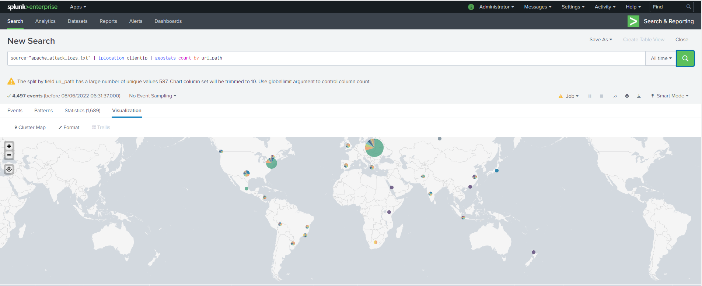
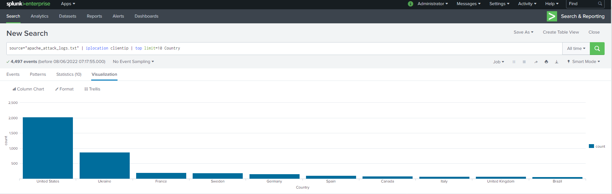

## Windows Server Attack

VSI’s Windows Server was attacked on March 25, 2020. Several user accounts were impacted, primarily user_a and user_k. A suspicious number of events with the signature “A user account was locked out” were detected in the 1:00 AM and 2:00 AM hours, primarily from user_a. During the 9:00 AM and 10:00 AM hours, a suspicious number of events with the signature “An attempt was made to reset an account’s password” were detected, primarily from user_k. Based on these attack signatures, the SOC team at VSI recommend the following mitigations:
-	User accounts should be locked out after 5 incorrect attempts. This would decrease the vulnerability of several user accounts, as 805 total lockouts occurred during the 1:00 AM hour.
-	 Two consecutive lockouts occurring from the same IP address should result in the user account being locked out indefinitely, and that IP address should be blocked from all future login attempts.
-	Users should only be allowed to attempt to reset their password once in any 24-hour period. During the 9:00 AM hour, 1,258 total attempts were made to reset a password. Limiting the number of times a user can reset their password would mitigate this vulnerability.
-	To further protect individual user accounts, users should be required to use some sort of multi-factor authentication (“MFA”).

VSI has insider information that JobeCorp attempted to target users by sending “Bad Logins” to lock out every user. To mitigate against this vulnerability, the SOC team recommends the following mitigation:
-	If three or more “Bad Logins” are detected originating from a single IP address (that is not a VSI IP address), that IP address should be blacklisted and prevented from accessing the user account login in the future.

## Apache Webserver Attack

VSI’s Apache Webserver was attacked on March 25, 2020 between the hours of 6:00 PM and 9:00 PM. Based on available data, it seems this attack originated in Kiev, Ukraine. To mitigate against future attacks from the same threat actor, the SOC team recommends the following firewall rule be implemented:
-	Block all incoming HTTP traffic where the source IP comes from Kiev, Ukraine.

The geographic map of incoming traffic during the attack is shown below.

The top 10 countries by source IP before the attack is shown below. 

VSI has insider information that JobeCorp will launch the same webserver attack, but use a different IP address each time in order to avoid being stopped by the above firewall rule. To mitigate against future attacks, the SOC team recommends the following firewall rules be implemented:
-	Block any IP address which generates three or more consecutive POST requests to the login page (“/VSI_Account_logon.php”). This would prevent any brute-force attacks on the login page, regardless of source IP.
-	Block any IP address which generates three or more consecutive POST requests identified by the user agent string “Mozilla/4.0 (compatible; MSIE 6.0; Windows NT 5.2; SV1; .NET CLR 2.0.50727987787; InfoPath.1)”. During the attack, 1,296 requests had that user agent string, while very little traffic during normal operation has that user agent.
